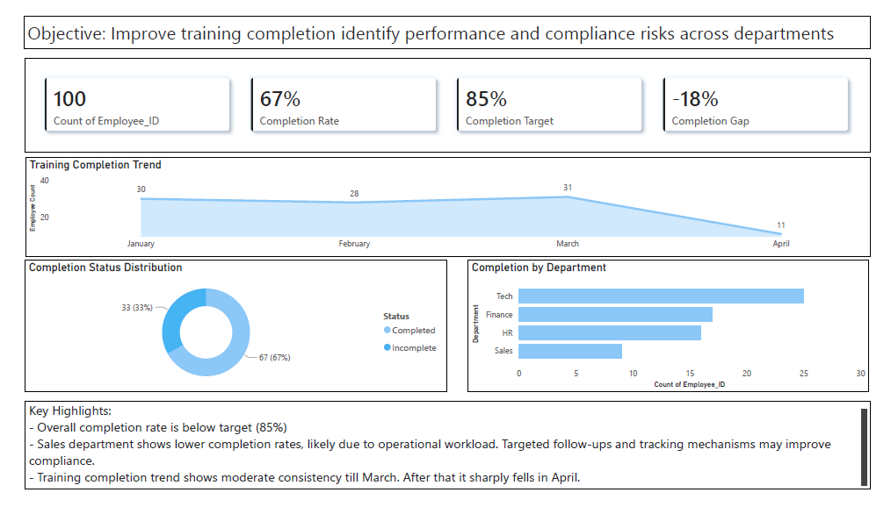
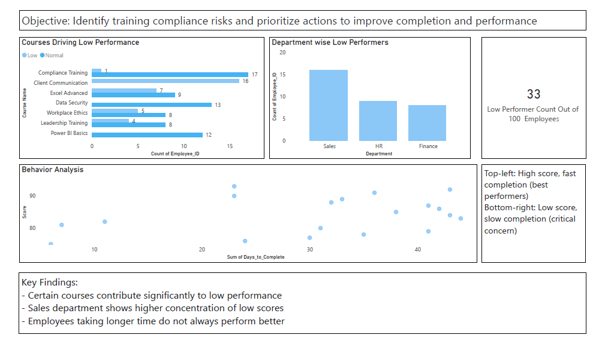
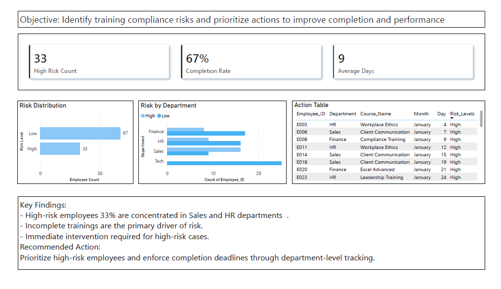

# 📊 Training Performance & Risk Analytics

## 📌 Overview

Organizations invest heavily in employee training programs, yet lack visibility into:
- Which learners are at risk of failing
- What factors impact training performance
- How to improve training effectiveness

This project builds a **data-driven risk classification system** to identify high-risk learners and support proactive intervention.

---

## 🎯 Objective

The goal of this project is to:

- Analyze training performance data
- Identify patterns affecting learner success
- Classify learners into risk categories
- Enable data-driven decision-making for training managers

---

## 📂 Dataset

The dataset includes:

- Employee details (Department, Role)
- Course information
- Enrollment & completion dates
- Training status (Completed / Incomplete)
- Assessment scores

> Note: Dataset is simulated for demonstration purposes.

---

## ⚙️ Approach

The project follows a structured analytics workflow:

1. Data Cleaning & Preprocessing  
2. Exploratory Data Analysis (EDA)  
3. Feature Engineering  
4. Risk Classification using rule-based logic  
5. Dashboard visualization using Power BI  

---

## 🧠 Risk Classification Logic

A rule-based model is used to classify learner risk:

- Incomplete learners → **High Risk**
- Learners with low scores (<70) → **Medium Risk**
- Learners with delayed completion (>10 days) → **Medium Risk**
- Others → **Low Risk**

This approach ensures:
- Simplicity  
- Interpretability  
- Business relevance  

---

## 🔄 System Workflow

**Input:**
- Learner training data (status, score, completion time)

**Process:**
- Risk classification using predefined business rules

**Output:**
- Risk levels displayed through an interactive dashboard

---

## 📊 Dashboard Insights

Key insights derived from the analysis:

- Incomplete learners represent the highest risk group  
- Low scores indicate potential performance issues  
- Delayed completion reflects learner disengagement  

---

## 💼 Business Impact

This solution enables organizations to:

- Identify high-risk learners early  
- Take proactive intervention measures  
- Improve training completion rates  
- Optimize training ROI  
## Dashboard Preview

### Executive Overview

### Performance Insights

### Risk & Action Dashboard

## 🧩 Use Case

A training manager can use this system to:

- Monitor learner performance in real time  
- Detect at-risk employees  
- Provide targeted support and follow-ups  

---

## 🚀 Future Scope

- Integrate with LMS platforms (e.g., Cornerstone, ServiceNow)  
- Automate risk alerts for managers  
- Deploy as a web application (Streamlit)  
- Enhance with predictive models  

---

## 🛠️ Tech Stack

- Power BI  
- Excel / CSV  
- DAX (Data Analysis Expressions)  

---

## Note

This project is created for portfolio purposes and demonstrates applied business analytics and decision-support thinking.
